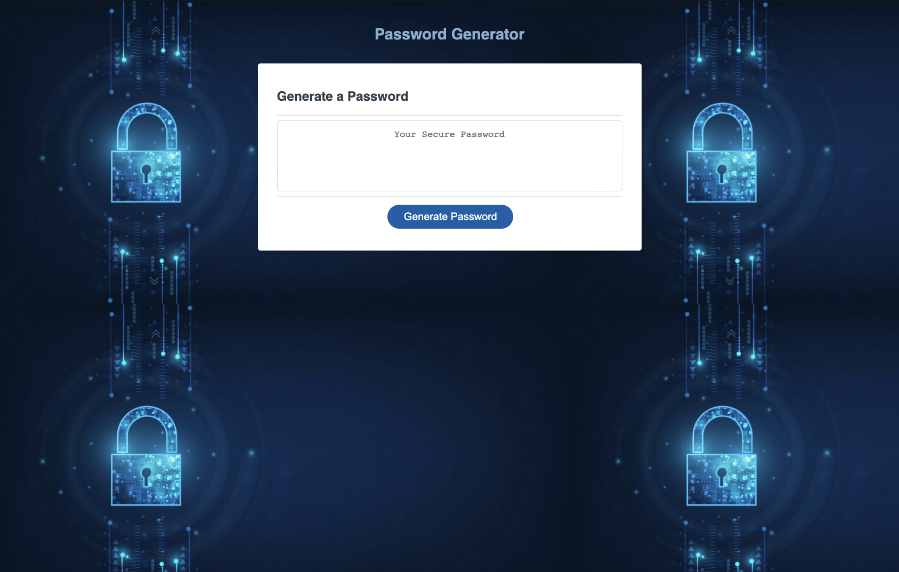

# Password_Generator

# Description

* Created a password generator application

* The following is what this application consists of:

    *  Botton to generate password
    *  Alert box that runs the user through the criteria needed to create the password
    *  Based on the criteria selected by said user the application produces a password to meet the given conditions
    *  Character length of 8 - 124 characters
    *  Lowercase, Uppercase, numbers, and special characters defined
    *  Password output is displayed in text-box 

# Application Screenshot

# Github Deployement Link

https://chasenicks.github.io/Password_Generator/
    